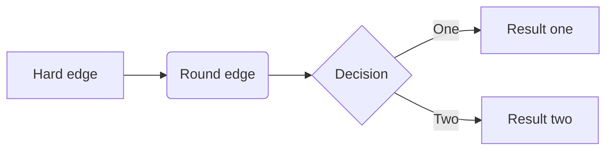

# code for the ESP8266
https://randomnerdtutorials.com/esp8266-pinout-reference-gpios/

https://www.aranacorp.com/fr/programmer-un-nodemcu-esp8266-avec-lide-arduino/

https://mechatronicsblog.com/esp8266-nodemcu-pinout-for-arduino-ide/

