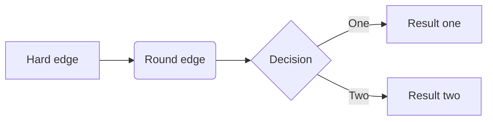

# sound

## preampli circuit

LM358N ampop dual

https://protosupplies.com/product/lm358/

3-20V supply

## ADC

```mermaid
graph LR
A[Hard edge] -->B(Round edge)
    B --> C{Decision}
    C -->|One| D[Result one]
    C -->|Two| E[Result two]
```