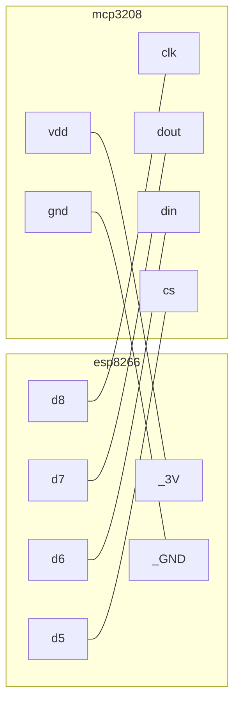

# sound

## ESP8266

## preampli circuit

LM358N ampop dual

https://protosupplies.com/product/lm358/

3-20V supply

## ADC

## schematic

```mermaid
graph LR 


subgraph esp8266
    d5
    d6
    d7
    d8
    _3V
    _GND
end
subgraph mcp3208
    vdd;
    gnd;
    clk;
    dout;
    din;
    cs;
end
d5 --- cs
d6 --- din
d7 --- dout
d8 --- clk
vdd --- _3V
gnd --- _GND

``` 
