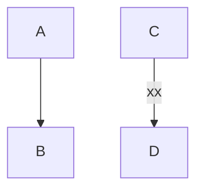

# EPortier

Aller dans ESP8266
puis dans garage
make start

## cloner le repo dans ~ a cause de ide arduino

## Sur le NUC

- installer apache2 sur NUC : apt install apache2
- mettre le script html  dans /var/www/html

## sur la box :
  - donner une @ statique a NUC ( bail statique)
  - rediriger les ports sur la box : WAN 8083 => LN <ip nuc>:80 

  - donner une @ statique a ESP8266( bail statique)
  - rediriger les ports sur la box : WAN 8082 => LAN <ip esp>:80
  
  IP NUC = 192.168.0.157
  IP ESP = 192.168.9.156
  
  note : IP box = 78.207.134.29

## sur arduino
 
  le board = NodeMCU
  avec un chip = 8266
- sur linux installer l'ide arduino le plus récent
- configurer l'IDE ( chaine de compil)
  
-https://www.xtronical.com/basics/systems/esp8266mcu-et-al/setting-nodemcu-v3-esp-12e-esp8266-arduino-ide/

https://arduino.stackexchange.com/questions/36330/how-to-make-a-5-volt-relay-work-with-nodemcu

https://randomnerdtutori

## manip sur le pc dev

install arduino ide from https://www.arduino.cc/en/software#future-version-of-the-arduino-ide ( zip file )

chmod arduino-ide

checker le port en connectant/deconnectant l'arduino
faire
lsub
ll /dev/tty*
une ligne devrait (dis)apparaitre
si c'est USB0
sudo chown louis /dev/ttyUSB0

faire aussi
sudo usermod -a -G dialout louis

dans l'ide choisir ce port  ( tool/port )

===> point d'entree : http://176.161.19.7:8080"

c'est redirigé vers le nodemcu qui est à http://192.168.1.95/";

## héberger une page dans un serveur http*s*

 - https://www.blogtriggers.com/2021/03/how-to-host-website-in-google-drive.html
 - https://api.drv.tw/~garbish.garbish@googlemail.com/gd/?a=admin#authed=1

j'ai créé une page dans un folder www.mimosas.bzh dans le compte garbish.garbish

https://api.drv.tw/~garbish.garbish@googlemail.com/gd/?a=admin#authed=1

 
