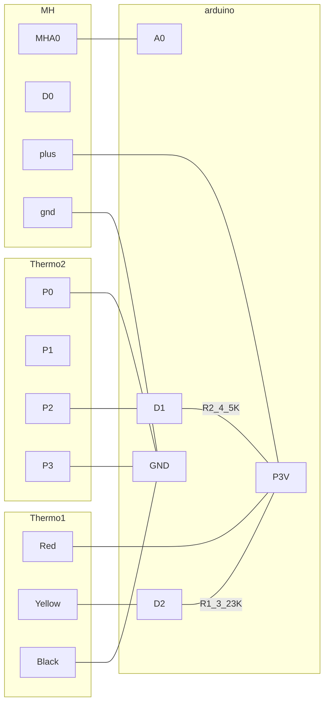

## install systeme
a mettre dans cron ( via sudo crontab -u louis -e )

@reboot sleep 12 && cd /media/usb-seagate2/dev/git/EPortier/robot_chaudiere/frontend/ && make run >> /tmp/traceSensor.trc 2>&1

## schéma

