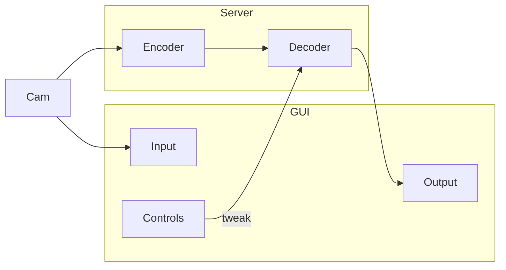

```mermaid
flowchart LR; 

 
    subgraph GUI
        Input["Input"];
        Output["Output"];
		Controls["Controls"];
    end
    subgraph Server
        Encoder["Encoder"];
        Decoder["Decoder"];
    end
	Cam --> Encoder;
	Cam --> Input;
	Encoder --> Decoder;
	Decoder --> Output;
	Controls -- tweak --> Decoder;
	

```

